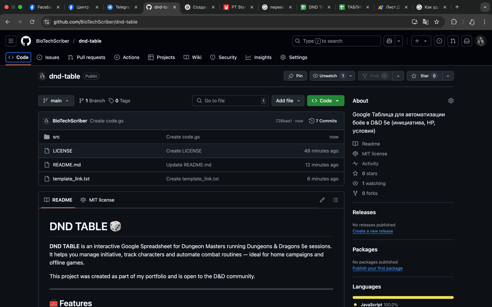
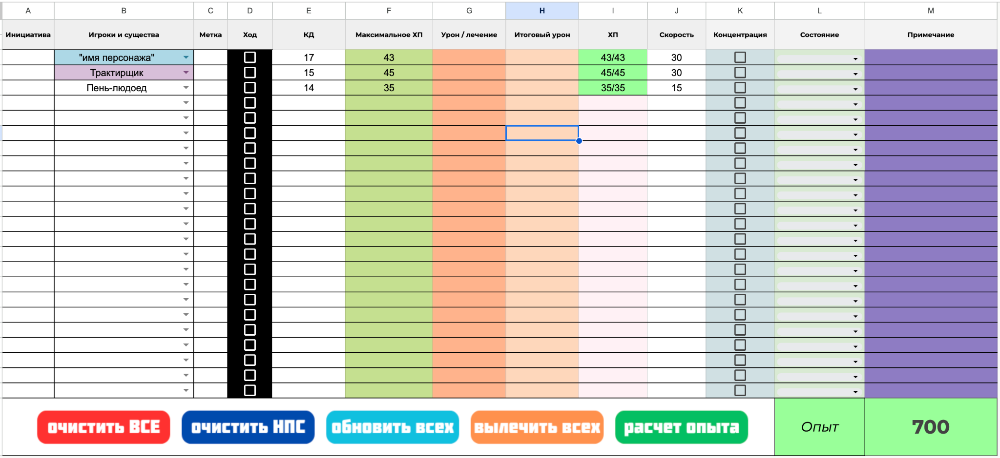
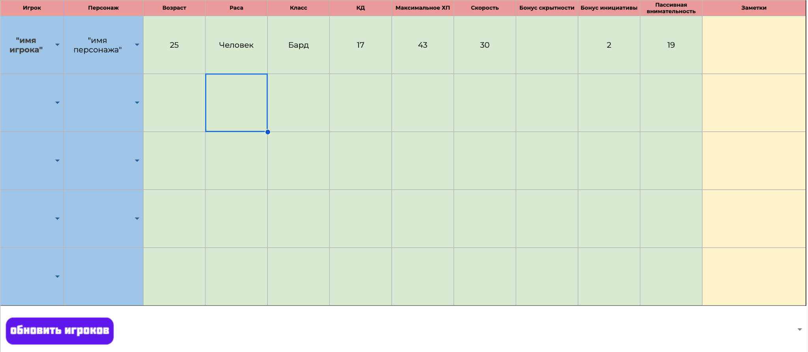
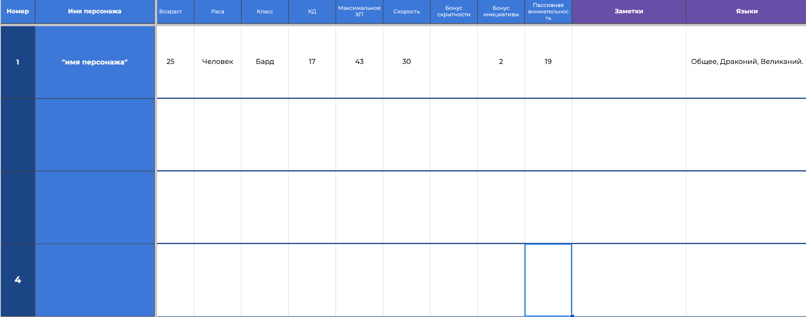
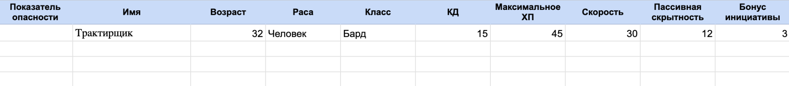

# DND TABLE 🎲

**DND TABLE** is an interactive Google Spreadsheet for Dungeon Masters running Dungeons & Dragons 5e combat. It allows you to track HP, statuses, initiative, and more — fully automating combat management through Google Apps Script.

> This project is part of my portfolio. If you use or adapt it, I kindly ask that you credit this repository.

---

## 🌐 Language

This page is available in other languages:

- 🇷🇺 [Русская версия](README.ru.md)

---

## 🧰 Features

- Fully automated combat tracker
- Track HP, conditions, speed, AC, concentration, and more
- Easily select PCs, NPCs, and monsters via dropdowns
- Interactive buttons for resets, updates, healing, XP calculation
- Powered by Google Apps Script for automation
- Scales for any group size

---

## 🚀 Get Started

1. Copy the template here:  
   👉 [Open the spreadsheet](https://docs.google.com/spreadsheets/d/11k8OB7f6tUrHSVqk8r4QI8oq5LzflEFli-96TdRWbPc/copy)

2. Add players, NPCs, and monsters on the appropriate sheets  
3. Use the **INITIATIVE** sheet to manage combat in real time

> No advanced knowledge required — intuitive layout and controls

---

## 🗂️ Sheet Structure

### 📍 INITIATIVE (main combat sheet)

### 📍 PLAYER LIST

### 📍 PLAYER TABS

### 📍 NPCs

### 📍 MONSTERS

---

## 🧑‍💻 How the Code Works

All automation is done using Google Apps Script.  
Source code is located in the [`/src`](src/) folder and handles:
- Initiative sorting
- Turn cycling
- HP and state calculations
- Checkbox and dropdown synchronization
- Button actions (update, clear, XP, etc.)

---

## 🔜 Roadmap

- Planned integration with 5etools or D&D Beyond
- In-sheet user guide and tooltips
- Custom condition tracking and monster templates

---

## 📄 License

This project is licensed under the **MIT License**.  
If you use or fork this project, please retain a link to the original repository.

---

## 📬 Feedback & Contributions

Found a bug or want to suggest a feature?  
Feel free to open an issue or submit a pull request.

Created by **Aleksandr Vasilev**  
GitHub: [@BioTechScriber](https://github.com/BioTechScriber)
